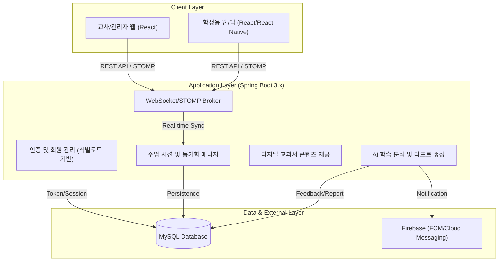

# 하이레벨 아키텍처 설계서 (High-Level Design)

본 문서는 디지털 교과서 서비스 **'DTProject'**의 전체적인 시스템 구조와 기술 스택을 정의합니다. 초기 1학급(30명) 규모의 안정적인 서비스를 목표로 하며, 확장이 용이한 모놀리식 아키텍처를 지향합니다.

## 1. 전체 시스템 구조

## 2. 선택된 기술 스택 및 선정 근거 (Rationale)

| 기술 분류 | 선택 기술 | 선정 근거 (Trade-off 분석) |
| :--- | :--- | :--- |
| **Backend Framework** | Java / Spring Boot 3.x | 풍부한 라이브러리 생태계, 강력한 보안(Spring Security), 정적 타입 언어를 통한 안정성 확보. Spring Boot 3.x의 최신 최적화 기능 활용. |
| **Real-time Sync** | WebSocket + STOMP | 교사-학생 간 화면 동기화 및 실시간 판서 공유를 위해 필수적입니다. STOMP는 메시지 프로토콜 규격이 명확하여 메시지 라우팅 및 처리 로직 구현이 용이합니다. |
| **Frontend Framework** | React / React Native | 컴포넌트 기반 구조로 생산성이 높으며, '아이좋아' 홈페이지 스타일의 웹 UI와 추후 앱 확장을 위한 RN과의 코드 공유 가능성을 고려했습니다. |
| **Database** | MySQL | 학급/학생/학습 데이터의 관계가 명확하므로 RDBMS가 적합하며, 범용적이고 신뢰성이 높아 초기 구축에 유리합니다. |
| **Cloud Services** | Firebase | 푸시 알림(FCM) 및 초기 개발 단계에서의 실시간 기능 보완을 위한 가장 빠르고 효율적인 솔루션입니다. |
| **Infrastructure Strategy** | Monolith 우선 | 현재 1인 개발/단기 출시 일정에서 분산 환경(MSA)은 과도한 오버엔지니어링(Over-engineering)입니다. 단일 애플리케이션 내에서 모듈화하여 관리한 후, 필요 시 서비스별로 분리하기 쉬운 구조로 설계합니다. |

## 3. 주요 컴포넌트 역할

1.  **회원/인증 매니저:** 학교 코드를 기반으로 한 간편 회원가입 및 교사/학생 권한 분리(RBAC)를 담당합니다.
2.  **수업 동기화 엔진:** 교사의 화면 이동(Page Index), 드로잉(Drawing data)을 STOMP 토픽으로 발행하고 학생 클라이언트에 실시간으로 전파합니다.
3.  **학습 분석 모듈 (AI):** 학생의 학습 이행도(오답, 체류 시간 등)를 수집하여 축적하고, 정기적으로 학습 패턴을 분석하여 교사에게 인사이트를 제공합니다.
4.  **집중 관리 시스템 (Focus Guard):** 수업 시작 시 학생 기기의 학습 외 활동을 제어하기 위한 정책을 관리합니다 (초기 웹 버전에서는 시뮬레이션 위주).

## 4. 인프라 배포 전략 (초기)

-   **Server:** Ubuntu OS 기반의 단일 VM 또는 가벼운 컨테이너(Docker) 환경.
-   **CI/CD:** GitHub Actions를 활용한 자동 빌드 및 배포 시스템 구축 예정.
-   **Storage:** 교과서 원본(PDF/이미지) 및 멀티미디어는 클라우드 스토리지(S3/Firebase Storage) 연동 권장.

---
> [!TIP]
> 실시간 동기화 시 메시지 부하를 줄이기 위해 판서 데이터(Drawing)는 압축된 JSON 형식 혹은 이진 데이터 전송을 고려하고 있습니다.
