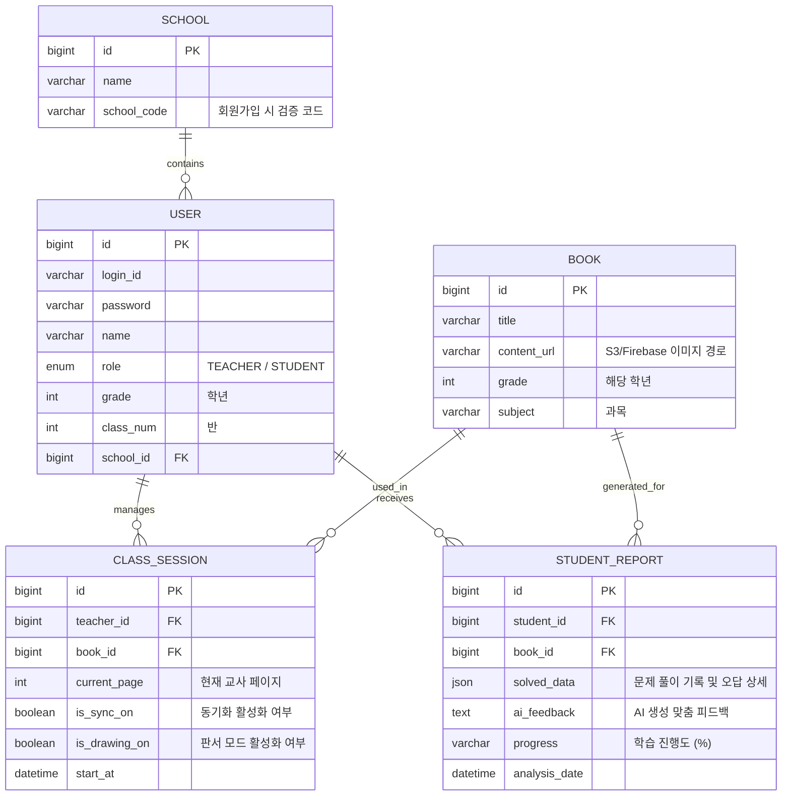

# 데이터베이스 및 API 상세 설계서 (Low-Level Design)

본 문서는 **'DTProject'** 개발을 위한 핵심 데이터베이스 테이블 구조와 API 엔드포인트를 정의합니다. 

## 1. 데이터베이스 ERD 설계 (MySQL)

## 2. API 엔드포인트 설계 (RESTful)

| 분류 | HTTP Method | Endpoint | 설명 |
| :--- | :--- | :--- | :--- |
| **Auth** | POST | `/api/v1/auth/signup` | 학교 코드 기반 회원가입 |
| **Auth** | POST | `/api/v1/auth/login` | 로그인 및 JWT 토큰 발급 |
| **Class** | GET | `/api/v1/classes` | 사용자가 속한 학급 및 수업 목록 조회 |
| **Session** | POST | `/api/v1/sessions/start` | (교사) 수업 세션 생성 및 시작 |
| **Session** | PATCH | `/api/v1/sessions/{id}/sync` | (교사) 동기화 모드 On/Off 전환 |
| **Report** | GET | `/api/v1/reports/student/{id}` | 특정 학생의 AI 학습 리포트 조회 |
| **Report** | POST | `/api/v1/reports/analyze` | AI 분석 엔진 호출 및 리포트 저장 |

## 3. 실시간 통신 스키마 (WebSocket/STOMP)

-   **Endpoint:** `ws://{host}/ws-stomp`
-   **Broker Topics:**
    -   `/topic/class/{sessionId}/page`: 페이지 이동 정보 전송 (`{"type": "PAGE_MOVE", "page": 12}`)
    -   `/topic/class/{sessionId}/drawing`: 실시간 판서 데이터 전송 (`{"type": "DRAW", "data": "coordinates..."}`)
    -   `/topic/class/{sessionId}/monitor`: 학생 상태 모니터링 (`{"type": "STUDENT_STATUS", "studentId": 1, "status": "STUCK"}`)

---
> [!TIP]
> `STUDENT_REPORT` 테이블의 `solved_data`는 JSON 타입을 사용하여 문제별 체류 시간, 오답 빈도 등 비정형 데이터를 유연하게 저장합니다.
